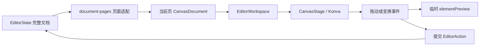

# 架构说明

## 1. 总览

项目是一个无后端的 React SPA。首页负责创建和恢复浏览器本地的 AI PPT 项目，Konva 负责画板渲染和交互，右侧 React 表单负责属性编辑。PPT 文档以“顶层分组即页面”的方式保存，通过页面适配层生成当前单页视图；导出时仍使用完整文档。

## 2. 技术栈

| 层     | 技术                               | package.json 版本                |
| ------ | ---------------------------------- | -------------------------------- |
| 构建   | Vite                               | `^7.2.4`                         |
| 语言   | TypeScript                         | `^5.9.3`                         |
| UI     | React / React DOM                  | `^19.2.0`                        |
| 样式   | Tailwind CSS                       | `^4.1.17`                        |
| 组件   | shadcn/ui、Radix UI                | `^4.13.1` / `^1.6.4`             |
| 画板   | Konva / react-konva                | `^10.3.0` / `^19.2.5`            |
| 富文本 | Plate                              | `53.2.4`                         |
| 拖放   | dnd-kit、dnd-kit-sortable-tree     | `^6.3.1`、`^10.0.0`、`^0.1.73`   |
| PPTX   | PptxGenJS                          | `^4.0.1`                         |
| 测试   | Vitest、Testing Library、happy-dom | `^4.0.13`、`^16.3.0`、`^20.0.10` |

## 3. 目录结构

```text
.
├── docs/                         # 产品、架构与开发文档
├── src/
│   ├── components/ui/            # 通用 UI 组件
│   ├── editor/
│   │   ├── components/           # 画板、工作区、图层、属性和总览
│   │   ├── canvas-viewport.ts     # 元素边界和视口定位
│   │   ├── document-pages.ts      # 文档到页面视图的适配
│   │   ├── editor-state.ts        # reducer、历史和元素树更新
│   │   ├── element-creation.ts    # 新建图形、文本和图片定位
│   │   ├── fonts.ts               # 画板字体定义与加载
│   │   ├── markdown.ts            # Markdown 转显示文本和 Canvas
│   │   ├── pptx-export.ts         # Canvas 文档到 PPTX
│   │   └── types.ts               # 文档和元素类型
│   ├── features/ai-ppt/           # PPT 结构、视觉方案、画布与本地存储
│   ├── pages/Home.tsx             # AI PPT 项目首页
│   ├── App.tsx                    # 全局 Tooltip Provider
│   └── main.tsx                   # React 入口
├── package.json
└── vite.config.ts
```

## 4. 数据模型

### 4.1 文档

`CanvasDocument` 的核心字段：

```ts
interface CanvasDocument {
  id: string;
  name: string;
  description: string;
  documentType: "longform" | "pptx";
  width: number;
  height: number;
  elements: CanvasElement[];
}
```

- 长图：`elements` 直接表示整张页面。
- PPT：每个顶层 `GroupElement` 表示一张幻灯片，组内元素使用该页本地坐标。
- PPT 文档的 `width`、`height` 表示单页尺寸，不表示所有页面拼接后的总高度。

### 4.2 元素

`CanvasElement` 是 `CanvasLeafElement | GroupElement`。

- 叶子元素包含位置、尺寸、旋转、透明度、显隐和锁定状态。
- 分组只包含元信息及 `children`。
- 显隐和锁定在查询元素上下文时沿父级继承。
- 元素 patch 使用条件类型生成，更新入口统一在 reducer 中归一化。

### 4.3 页面适配

`document-pages.ts` 将文档转换为统一的 `CanvasPage[]`：

- 长图返回一个页面。
- PPT 将顶层分组映射为多页。
- `createPageDocument` 创建只包含当前页元素的只读视图对象。

该视图对象只用于画板、图层和缩略图渲染；真实修改仍写回完整源文档。这样可以避免维护两份页面内容。

### 4.4 AI PPT 生成链路

AI PPT 使用“材料分析 → 内容结构 → 自动配图 → 视觉计划 → 初稿画布 → 看图评审 → 最终验证”分阶段模型：

```text
CreatePptStructureInput
→ PptMaterialPlan
→ PptStructure
→ PptAssetSearchPlan
→ Pexels 第 1 页候选图
→ PptAssetSelection / PptVisualAsset
→ PptVisualPlan
→ 初稿 CanvasDocument
→ 逐页低分辨率预览
→ PptVisualReview
→ [需要修订] 评审后的 PptVisualPlan
→ 重渲染 CanvasDocument
→ 最终逐页预览与二次评审
→ 编辑器 / PPTX
```

- `PptMaterialPlan` 将已有材料拆成带稳定 ID 的事实、优先级和缺口，并保存用户确认过的核心主张、叙事模式与章节方向。
- `PptStructure` 表达叙事结构和语义内容块；每页用 `evidenceRefs` 引用实际使用的材料事实。生成与进入视觉阶段前都会执行内容充足度校验，普通内容页、议程页和总结页不能以过少内容占用整页。图表保存分类、数值与结论，关系图保存节点、边与关系类型。
- `PptProject` 保存原始需求、确认后的材料计划、文本结构和累计模型用量。旧项目缺少材料计划时仍可读取。
- 模型先判断哪些页面确实需要图片。只有封面、章节、普通内容和结束页可申请图片，图表、表格、流程、对比、指标、议程和总结页使用原生信息结构。每个申请只检索 Pexels 第 1 页最多 12 个候选，再由模型自动选择最合适的一张，不向用户展示选择器。
- Pexels Key 只存在于当前页面内存；可选图片在缺少 Key、检索失败或无合适结果时降级为无图，模型明确标记为必需的图片失败时终止生成。素材记录目标页、来源页和摄影师链接，防止跨页误用并满足署名要求。
- `PptVisualPlan` 为每页指定页面节奏、主视觉类型、构图方式、版式变体和强调块，不重复保存正文内容；图片只能引用为当前页自动检索的素材。
- 画布渲染器根据以上数据生成文本、图片、形状、连线、表格和原生图表。标题、正文设演示阅读下限，布局优先重排而不是缩小字体；每页还检查有效视觉占比，拒绝内容缩在局部而留下大面积无意义空白的结果。
- 初稿画布在浏览器内渲染为逐页预览，Qwen 以多模态输入检查层级、密度、节奏、重复、字体、颜色和内容适配。评审只能返回完整的修订 VisualPlan，不能修改内容结构或 Canvas 坐标。
- 本地校验评审声明的主题变化和页面变化是否与实际 VisualPlan 差异一致；存在 `critical` 问题时不得通过。若首轮评审修订了方案，系统会重渲染、重新截图并执行一次最终验证；最终验证仍要求修订时终止生成，避免把未通过页面交给编辑器，也避免无界循环。
- 预览图片、百炼 Key 和 Pexels Key 只存在于当前页面内存。画布产物保存评审摘要、问题账本、最终 VisualPlan、图片来源元数据和最终 CanvasDocument，不持久化 API Key 或预览截图。
- 图表在 Canvas 中保留结构化数据并导出为 PPT 原生图表；关系图由可编辑形状和箭头组成。
- 视觉策划提示词、视觉评审提示词与渲染器分别记录版本。旧产物仍可读取，但版本落后时会标记为需要重新生成，避免静默覆盖用户编辑。

## 5. 编辑器状态

`EditorState` 保存：

| 字段                     | 含义                               |
| ------------------------ | ---------------------------------- |
| `documents`              | 按文档 ID 保存当前会话中的可变文档 |
| `activeTemplateId`       | 当前文档                           |
| `activePageIdByTemplate` | 每个文档上次访问的页面             |
| `selectedId`             | 当前元素                           |
| `manualZoomByTemplate`   | 每个文档的手动缩放值               |
| `fitMode`                | 是否自动适应画板                   |

文档内容使用 reducer 更新。历史结构为 `past / present / future`，只保存 `documents` 快照；选择和视图状态不进入撤销栈。

### 5.1 PPT 页面写入

`updateActiveElements` 根据文档类型选择写入位置：

- 长图：更新文档根元素。
- PPT：只更新 `activePageId` 对应顶层分组的 `children`。

因此新建元素、图层排序、删除和属性修改都天然限制在当前幻灯片内。

### 5.2 页面排序

`reorder-pages` 重排 PPT 顶层分组。重排后会：

1. 保持页面和元素 ID 不变。
2. 更新分组名称的数字前缀。
3. 更新名称包含“页码”且内容符合 `数字 / 数字` 的标准页码文本。
4. 记录为可撤销文档操作。

## 6. 渲染与交互链路



### 6.1 画板

`CanvasStage`：

- 每个元素映射为对应 Konva 节点。
- 节点 ID 与文档元素 ID 一致。
- `nodeRefs` 保存元素与节点的映射，用于 Transformer。
- 选择框和悬停框使用两个独立 Transformer。
- `readOnly` 模式关闭监听和 Transformer，用于幻灯片缩略图。
- 画板导出通过 `documentGroupRef.toDataURL` 获取页面内容。

### 6.2 临时预览

Konva 拖动和变换过程中使用 `elementPreview` 更新属性面板，不立即进入历史。

文本宽度变换是例外：预览 patch 会生成临时页面文档并重新绘制文字 Canvas，从而按新宽度换行，而不是缩放位图字形。变换结束后才提交真实文档操作。

### 6.3 文本变换

实现遵循 Konva Transformer 的约束：

- Transformer 实际修改 `scaleX` / `scaleY`。
- 文本仅启用左右中点锚点。
- 变换时将 `width × scaleX` 写回真实宽度，并把 scale 重置为 1。
- 高度、字号和行高保持原值。
- 拖动处理函数只提交 `x`、`y`。

参考：

- [Konva：Resize Text](https://konvajs.org/docs/select_and_transform/Resize_Text.html)
- [Konva：Drag Events](https://konvajs.org/docs/drag_and_drop/Drag_Events.html)
- [Konva：Access Konva Nodes](https://konvajs.org/docs/react/Access_Konva_Nodes.html)

## 7. 文本渲染

文本支持受限行内 Markdown：

- Markdown 由 `marked` 解析并过滤不支持的链接、图片和 HTML。
- `render-tag` 将安全的行内 HTML 渲染到临时 Canvas。
- Canvas 缓存键包含内容、尺寸、字体和样式。
- 缓存总像素上限为 16M，按最早使用顺序淘汰。
- 字体加载完成后清空缓存并触发重绘。
- 富文本编辑使用 Plate 单块编辑器，提交时重新序列化 Markdown。

## 8. 图层排序

- 图层树使用 `dnd-kit-sortable-tree`。
- 页面总览使用 dnd-kit sortable preset 和网格排序策略。
- 两处都配置 PointerSensor 和键盘交互。
- reducer 接收排序后的 ID 或元素树，并保持更新函数纯净。

参考：[dnd-kit Sortable](https://dndkit.com/legacy/presets/sortable/overview/)。

## 9. 导出链路

### 9.1 PNG

```text
EditorWorkspace
→ CanvasStageHandle.exportImage
→ Konva Group.toDataURL(pixelRatio: 2)
→ 浏览器下载
```

### 9.2 PPTX

```text
完整 PPT CanvasDocument
→ 读取可见顶层分组
→ 展平可见叶子元素
→ 计算单页坐标缩放
→ 映射文本、图片、线条和形状
→ PptxGenJS.writeFile
```

文本使用 `addText` 写入真实文本框。行高使用 PptxGenJS 的倍数值，字体通过固定映射保证中文可用。图片在导出过程中转换为 PNG 数据并缓存。

## 10. React 组件边界

| 组件                    | 职责                                       |
| ----------------------- | ------------------------------------------ |
| `Home`                  | 组合编辑器状态、页面模式、快捷键和三个面板 |
| `LayerSidebar`          | 文档/页面二级导航和当前页图层              |
| `EditorWorkspace`       | 视口、平移缩放、创建工具、导出入口         |
| `CanvasStage`           | Konva 渲染、选中、拖动、变换、画板导出     |
| `SlideOverview`         | PPT 缩略图总览、页面选择、排序和导出       |
| `PropertiesPanel`       | 受控属性表单                               |
| `RichTextEditorOverlay` | 覆盖在画板上的 Plate 富文本编辑器          |

状态提升和 reducer 结构参考：

- [React：Sharing State Between Components](https://react.dev/learn/sharing-state-between-components)
- [React：Extracting State Logic into a Reducer](https://react.dev/learn/extracting-state-logic-into-a-reducer)
- [React：Choosing the State Structure](https://react.dev/learn/choosing-the-state-structure)

## 11. 测试策略

- reducer 测试覆盖元素更新、历史、页面选择、单页写入和页面排序。
- CanvasStage 测试覆盖选择、图片裁切、字体、文本拖动和文本宽度变换。
- Home 集成测试覆盖三栏结构、文档切换、PPT 二级页面、总览和属性预览。
- PPTX 测试解压生成文件并检查 slide XML 中的文本、字体和行距。
- 测试环境为 happy-dom；Canvas、Konva 和浏览器下载通过 mock 或结构断言验证。

## 12. 部署与运行

项目输出纯静态前端资源：

```bash
pnpm build
```

产物位于 `dist/`。当前没有运行时环境变量、后端服务或数据库依赖。
